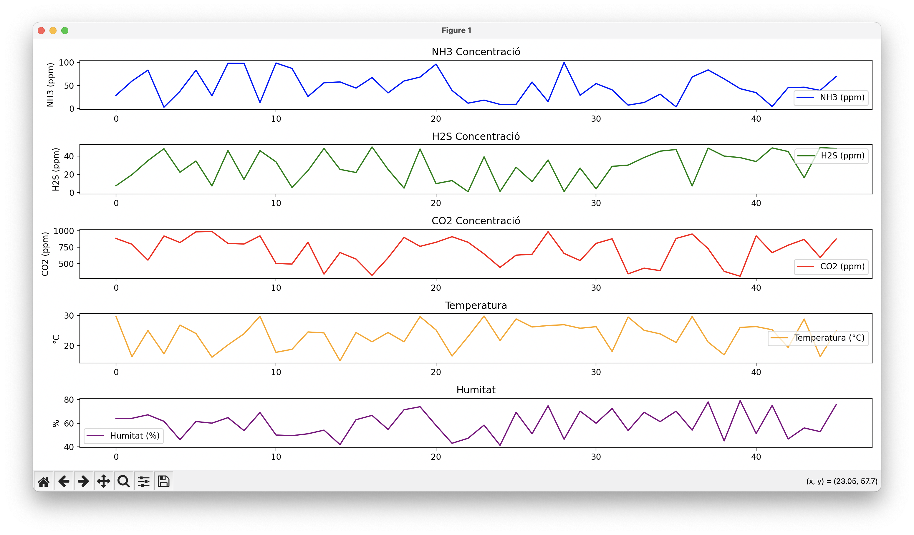

# Tecnologia oberta i sostenible pel monitoratge de la qualitat de l'aire a les naus ramaderes

Aquest projecte conté un codi per llegir dades de diversos sensors, incloent un sensor digital de temperatura i humitat
**HS3003**, així com sensors analògics per a mesurar **NH3**, **H2S** i **CO2**. 
Les lectures es realitzen cada 2 segons i s'envien a una interfície de visualització en format CSV, on es poden 
visualitzar en temps real mitjançant una gràfica.

El repositori inclou dos fitxers principals:

- **sensors.ino**: programa en Arduino per llegir dades dels sensors.
- **visualizer.py**: script en Python per visualitzar les dades rebudes.

## Requisits

- [Arduino IDE](https://www.arduino.cc/en/software).
- Python 3.11 o superior.
- Llibreries Python necessàries (pots instal·lar-les amb `pip`):
  ```bash
    pip install matplotlib pyserial
  ```

## Ús

1. Sensors: Assegura't que els sensors estan connectats correctament a la placa Arduino.

2. Arduino:
   - Connecta la placa Arduino a l'ordinador. Assegura't que la placa està connectada al port correcte.
   - Obre `sensors.ino` amb l'IDE d'Arduino.
   - Carrega el codi a la placa Arduino.

### Exemple de Sortida

```csv
NH3_Concentration,H2S_Concentration,CO2_Concentration,Temperature,Humidity
5.00,1.50,400.00,22.50,55.00
```

3. Python:
   - Executa `visualizer.py` per la visualització de les dades dels sensors en temps real mitjançant una gràfica.  

<p align="center">
  
</p>

## Contribució
Les contribucions són benvingudes! Si vols millorar aquest projecte, no dubtis a obrir una `issue` o enviar un `pull request`.

## Llicència
Aquest projecte està sota la llicència **Apache-2.0**. Consulta el fitxer [LICENSE](https://github.com/betatechcenter/moduls_sensorials/blob/main/LICENSE) per a més detalls.